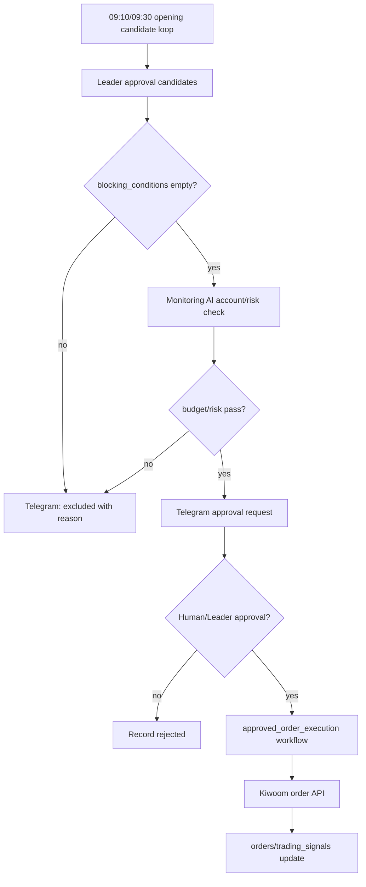

# Leader AI 승인형 주문 Workflow 설계 v1

상태: 설계 완료 / 자동 주문 미구현. 현재 기준은 `docs/strategies/current_trading_execution_plan.md`를 우선한다.  
목적: Research AI가 만든 후보를 Leader AI가 승인형으로 검토하고, Monitoring AI 리스크 체크를 통과한 경우에만 별도 주문 실행 workflow로 넘긴다.

---

## 1. 핵심 원칙

```text
1. Research AI는 주문을 내지 않는다.
2. n8n은 승인 게이트/알림/재시도만 담당한다.
3. Leader AI는 주문 후보를 검토하지만, 초기 운영에서는 사람 승인 또는 모의 주문만 허용한다.
4. pattern_model_not_ready, snapshot_1m_accumulation_and_backtest_required, no_budget, account_risk 등의 blocking_conditions가 있으면 주문 후보에서 제외한다. `ka10005`는 분봉 소스로 사용하지 않는다.
5. 실제 주문 API는 별도 `approved_order_execution` workflow로 분리한다.
```

---

## 2. 입력

| 입력 | 출처 |
|---|---|
| opening 09:10/09:30 결과 | `scripts/run_opening_strategy_candidate_loop.py` |
| 후보 압축 결과 | `scripts/candidate_compression_layer.py` |
| 계좌/예수금/보유 | Kiwoom `kt00004` 기반 Monitoring AI |
| 주문 제한 | 예산, 일일 손실 한도, 종목당 최대 금액 |
| 사용자 승인 | n8n Telegram/Manual Trigger |

---

## 3. 승인 조건 후보

| 조건 | 기본값 | 설명 |
|---|---:|---|
| opening score | 70 이상 | 2차 딥리서치 기준 |
| signal_type | BUY | HOLD/WATCH는 알림만 |
| blocking_conditions | empty | 하나라도 있으면 주문 금지 |
| 종목 수 | 최대 3개 | 100만원 예산 기준 과분산 방지 |
| 종목당 예산 | 20~30만원 | 3개 이내 분산 후보 |
| 일일 총 예산 | 100만원 이하 | 사용자 운영 경험 기준 |
| 손절 기준 | -0.7~-0.9% | OR10/OR30 모드에 따라 적용 |
| 익절 기준 | +1.0%, +2.0% | 1차/2차 익절 후보 |

---

## 4. workflow 단계



---

## 5. 주문 실행 전 blocking conditions

```text
pattern_model_not_ready_for_auto_order
snapshot_1m_accumulation_and_backtest_required
need_90_trading_days_intraday_prices
insufficient_backtest_trade_count
opening_candidate_list_empty
candidate_compression_invalid_json
score_below_buy_threshold
account_query_failed
budget_exceeded
position_already_open
daily_loss_limit_reached
telegram_approval_missing
```

---

## 6. 산출물

별도 템플릿:

```text
workflows/n8n/leader_approval_order_workflow.template.json
```

초기에는 주문 API 노드를 넣지 않고 승인 요청/기록까지만 설계한다. 실제 주문은 Kiwoom 주문 TR 검증 후 추가한다.
